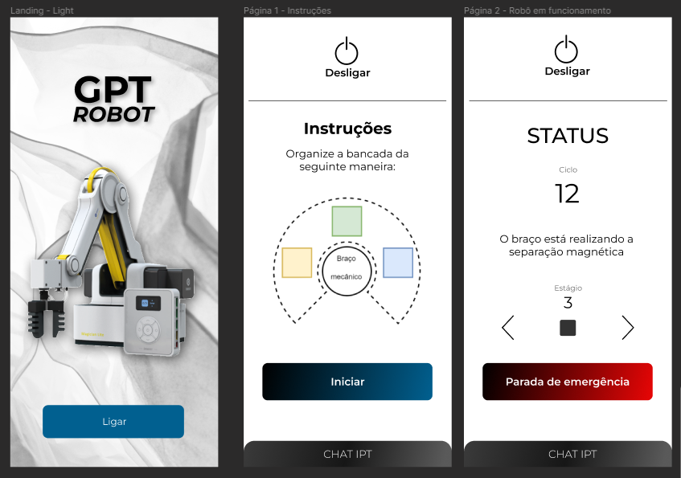
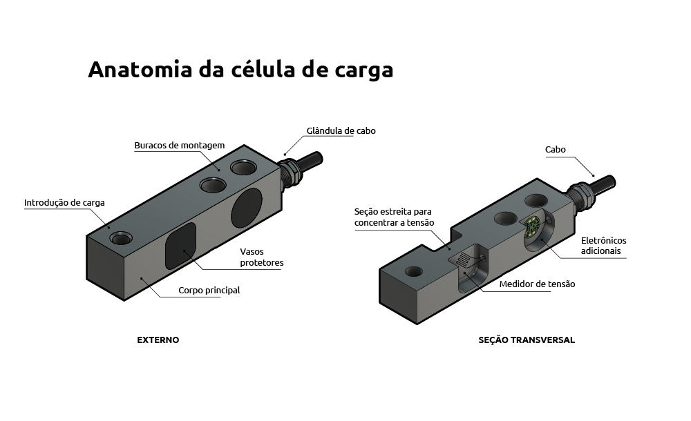
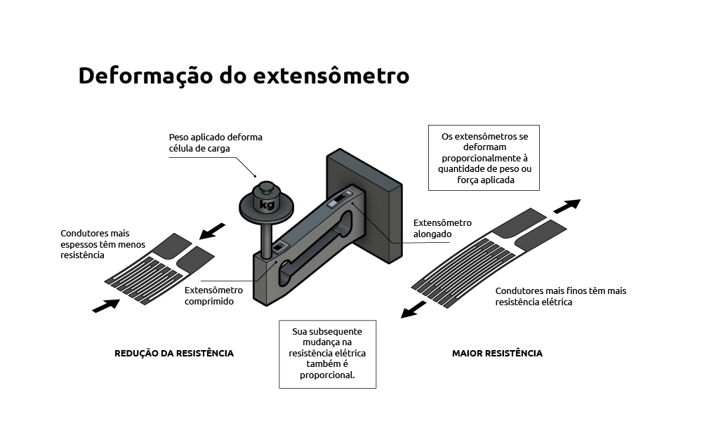
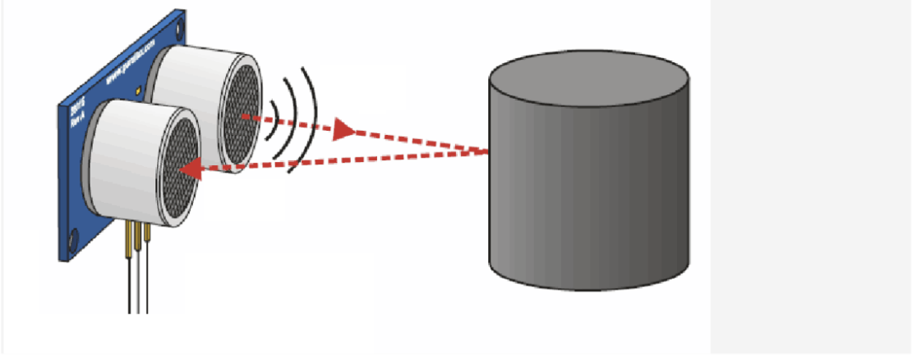

<table>
<tr>
<td>

</td>
<td>
</td>
</tr>
</table>

Concepção de sistema de automação industrial

>*Observação 1: A estrutura inicial deste documento é só um exemplo. O seu grupo deverá alterar esta estrutura de acordo com o que está sendo solicitado nos artefatos.*

>*Observação 2: O índice abaixo não precisa ser editado se você utilizar o Visual Studio Code com a extensão **Markdown All in One**. Essa extensão atualiza o índice automaticamente quando o arquivo é salvo.*

**Conteúdo**

- [Autores](#autores)
- [Visão Geral do Projeto](#visão-geral-do-projeto)
  - [Empresa](#empresa)
  - [O Problema](#o-problema)
  - [Objetivos](#objetivos)
    - [Objetivos gerais](#objetivos-gerais)
    - [Objetivos específicos](#objetivos-específicos)
  - [Partes interessadas](#partes-interessadas)
  - [Análise do cenário: Matriz SWOT](#análise-do-cenário-matriz-swot)
  - [Proposta de Valor: Value Proposition Canvas](#proposta-de-valor-value-proposition-canvas)
  - [Matriz de Risco](#matriz-de-risco)
  - [Oceano Azul](#oceano-azul)
  - [Análise Financeira](#análise-financeira)
- [Requisitos do Sistema](#requisitos-do-sistema)
  - [Personas](#personas)
  - [Mapa de Jornada do Usuário](#mapa-de-jornada-do-usuário)
  - [Histórias dos usuários (user stories)](#histórias-dos-usuários-user-stories)
- [Arquitetura do Sistema](#arquitetura-do-sistema)
  - [Módulos do Sistema e Visão Geral (Big Picture)](#módulos-do-sistema-e-visão-geral-big-picture)
    - [Croqui](#croqui)
    - [Diagrama da solução](#diagrama-da-solução)
  - [Descrição dos Subsistemas](#descrição-dos-subsistemas)
    - [Requisitos de software](#requisitos-de-software)
  - [Tecnologias Utilizadas](#tecnologias-utilizadas)
- [UX e UI Design](#ux-e-ui-design)
  - [Wireframe + Storyboard](#wireframe--storyboard)
  - [Design de Interface - Guia de Estilos](#design-de-interface---guia-de-estilos)
- [Testes de Hardware](#testes-de-hardware)
  - [Braço robótico](#braço-robótico)
    - [Alcance do braço](#alcance-do-braço)
    - [Posicionamento das bandejas](#posicionamento-das-bandejas)
    - [Conexão com servidor](#conexão-com-servidor)
  - [Eletroímã](#eletroímã)
    - [Controle do eletroímã](#controle-do-eletroímã)
    - [Controle de potência do eletroímã](#controle-de-potência-do-eletroímã)
  - [Outros sensores](#outros-sensores)
    - [Célula de carga](#célula-de-carga)
    - [Mini Bomba Motor D'água](#mini-bomba-motor-dágua)
  - [Sensor de distância ultrassônico](#sensor-de-distância-ultrassônico)
    - [Buzzer](#buzzer)
- [Manuais](#manuais)
  - [Manual de Implantação](#manual-de-implantação)
  - [Manual do Usuário](#manual-do-usuário)
  - [Manual do Administrador](#manual-do-administrador)
- [Referências](#referências)

# Autores

* Alysson Cordeiro
* Giovana Rodrigues Araujo
* Henrique Lemos Freire Matias
* Lucas Henrique Sales de Souza
* Lyorrei Shono Quintão
* Mihaell Brenno Alves
* Patricia Honorato Moreira

# Visão Geral do Projeto

## Empresa

O IPT é o Instituto de Pesquisas Tecnológicas, vinculado à Secretaria de Desenvolvimento Econômico do Estado de São Paulo e há 123 anos colabora para o processo de desenvolvimento do País.

## O Problema

O processo de separação de minerais realizado pelo IPT é manual, executado por meio de um técnico operador, que aproxima uma barra de ímã de ferrite, envolto em um saco plástico, do material que está submerso e espalhado em um recipente com água. 

Nessa etapa, o operador aproxima o íma sobre um primeiro recipiente que contém toda a amostra, para em seguida, em um segundo recipiente, limpar as impurezas contidas na amostra. Por fim os minerais são depositados em um recipiente final, que também contém água. 

Infere-se que esse processo é impreciso, sendo realizado diversas vezes e demandando treinamento apropriado do operador. Os metais não são totalmente retirados na primeira passagem pelo ferromagnético, em suma pela imprecisão do campo magnético do eletroímã devido a distância de manipulação, mas também pela necessidade de se testar diferentes campos por meio da troca de ímãs. 

## Objetivos

### Objetivos gerais

Desenvolveremos um equipamento automatizado que tenha capacidade de aplicar um campo magnético constante, com intensidade e distância ajustáveis, ao longo de toda a amostra, promovendo, assim, uma separação dos minerais magnéticos, os quais serão depositados em um recipiente diferente dos minerais não magnéticos que permanecerão depositados na bandeja original.

### Objetivos específicos

<ul> <li> Controle do campo magnético sobre toda a amostra a fim de reduzir os erros de ensaio decorrentes da ação humana; </li> <li> Maior qualidade na execução do ensaio, principalmente no que tange a repetibilidade e reprodutibilidade; </li> <li> Maior flexibilidade de ensaios, pois o uso de eletroímãs ajustáveis dispensa a necessidade de se ter ímãs com o campo desejado; </li> <li> Determinação mais precisa do campo magnético adequado para diferentes ensaios. </li> </ul>

## Partes interessadas

* IPT;
* Laboratório de Processos Metalúrgicos;
* Inteli.

## Análise do cenário: Matriz SWOT

## Proposta de Valor: Value Proposition Canvas

*Value_Proposition_Canvas*
 

Nossa proposta de valor envolve automatizar o processo de separação de metais que o IPT faz, sem alterar sua metodologia. Além disso, ela conta com um dispositivo magnético (um eletroimã) e um braço robótico (magician lite). Nesse sentido, nossa solução levará precisão no projeto, tendo em vista que não será necessária a alucação de recurso humano para o processo de separação (o qual possui um erro humano atrelado); consistência, visto que garantimos que a ciclicidade do processo seja completamente idêntica em todos os ciclos; escalabilidade devido à variabilidade que nossos produtos podem ter em questão de usos; porfim, automação ao processo, já que não será mais executado por humanos.

## Matriz de Risco

RISCOS
* Planejar um escopo maior do que o possível de entregar - Probabilidade: Médio; Impacto:	Alta
* Não entregar o projeto completo (integração com web app e tal)	Médio	Muito Alta
* Falta de acesso a um teste real poderá prejudicar a criação de um produto escalável - Probabilidade:	Muito Alta; Impacto:	Baixo
* Demandar muito tempo para determinadas atividades do projeto e negligenciar outras (como na configuração microcontrolador para a web application ou no frontend do serviço) - Probabilidade:	Baixo; Impacto:	Alta
* Parâmetros de medidas para relatórios de ensaio não bem definidos - Probabilidade:	Baixo; Impacto:	Muito Alta
* Não ter a participação de todos no desenvolvimento do frontend e backend - Probabilidade:	Alta; Impacto:	Médio
* Desacordo do grupo nas ferramentas utilizadas - Probabilidade:	Muito Baixo; Impacto:	Muito Baixo
* Ausência de integrantes do grupo nos desenvolvimentos - Probabilidade:	Baixo; Impacto:	Médio
* Dias das instruções de programação incompatíveis com o tempo de desenvolvimento desejado para entregas da SPRINT - Probabilidade: Médio; Impacto:	Médio
* Erro na construção da peça de encaixe para o braço robôtico - Probabilidade:	Médio; Impacto:	Muito Alta

OPORTUNIDADES
* Suporte do inteli e professores altamente qualificados - Probabilidade: Muito Alta; Impacto:	Muito Alta
* IPT ser um parceiro muito acessível e amigável em geral - Probabilidade:	Alta; Impacto:	Muito Alta
* IPT ter conhecimento técnico e científico sobre o problema que estamos prototipando uma solução, nos auxiliará na resolução de possíveis dúvidas e sugestões de melhorias	- Probabilidade: Baixo; Impacto:	Alta
* Desenvolver uma tecnologia escalável - Probabilidade: Médio; Impacto:	Muito Alta
* Curva de aprendizado do python ser muito simples - Probabilidade:	Médio; Impacto:	Alta

## Oceano Azul

Tendo em vista o gráfico acima, o qual compara nossa solução com o método tradicional e manual do IPT e com uma alternativa do mercado, a Grade Magnética, é necessário evidenciar 4 pontos importantes para nossa matriz de oceano azul:
<ul> <li> Primeiro, __aumentaremos__ a __consistência__ em relação aos métodos comparados, tendo em vista que o braço robótico, embora ajustável, executará todos os processos de maneira igual e consistente; </li> <li> Além disso, é evidente que precisamos __criar__, também, __facilidade na manutenção__ do hardware e do código que compõem o projeto; </li> <li> Outrossim, visto que o __preço__ de nossa solução é alto, precisamos encontrar formas de __reduzir__ esse fator; </li> <li> Por fim, __eliminaremos__ a necessidade de um __técnico de instalação__ do braço robótico por meio de um manual de instalação limpo e simples de compreender.</li>  </ul>

## Análise Financeira

*Descrição da análise*

# Requisitos do Sistema

*Descrição_dos_requisitos*

## Personas

*Descrição da persona*

## Mapa de Jornada do Usuário

## Histórias dos usuários (user stories)

* Eu, como técnico, quero poder automatizar a tarefa de manipulação de amostra de metais, para que eu possa alocar meu tempo em atividades mais valiosas.
* Eu, como técnico, quero poder delegar a tarefa repetitiva de separação metálica para um braço mecânico, a fim de evitar o desgaste físico e mental que esse processo manual e repetitivo causa.
* Eu, como técnico, gostaria de utilizar um braço mecânico preciso e confiável, para que eu possa realizar a tarefa de separação dos metais com eficiência e precisão, sem comprometer a qualidade dos resultados.
* Eu, como técnico, quero poder anexar o braço mecânico à minha estação de trabalho, para que possa automatizar a separação de liga metálica da amostra através de um processo magnético.
* Eu, como técnico, quero ter uma interface física, para controlar a movimentação precisa do braço mecânico.
* Eu, como técnico, quero ter uma estrutura fácil de manutenção para garantir que o dispositivo possa ser mantido em boas condições de funcionamento ao longo do tempo.
* Eu, como técnico, quero ter um encaixe para o braço mecânico criado a partir de modelagem 3D, para que possa garantir que o braço tenha uma interação perfeita com restante da estação e não prejudique o processo de separação de liga metálica.

# Arquitetura do Sistema

## Módulos do Sistema e Visão Geral (Big Picture)

### Croqui 

*Descrição do croqui*

### Diagrama da solução

*Descrição do diagrama*

## Descrição dos Subsistemas

### Requisitos de software

## Tecnologias Utilizadas

# UX e UI Design

## Wireframe + Storyboard

O Wireframe para nossa aplicação web, por enquanto (SPRINT2), consiste em 3 (três) páginas de um aplicativo que será desenvolvido em Flutter.

<ul> <li>A primeira página funciona como uma página inicial para o aplicativo, em que há um botão "Ligar" que ligará o braço robótico;</li> <li>A segunda página consiste em instruções para o usuário organizar as bandejas, de forma que o braço robótico reconheça cada uma;</li> <li>Por último, a terceira constitui-se de uma página dinâmica que apresenta o status em tempo real, com a opção de pular uma etapa do processo ou encerrá-lo imediatamente.</li> </ul>

## Design de Interface - Guia de Estilos

# Testes de Hardware

## Braço robótico
A primeira item que analisamos no braço foi a seu tipo de conexão. A forma de conexão que iniciamente é a mais fácil é via usb. Através disso, o conectamos a um notebook, e via uma biblioteca em python conseguimos solicitar movimentos e utilizar todas as suas ferramentas. Os primeiro testes então ocorreram a partir desse tipo de conexão mas almejamos solicitar essas atividades através de um microcontrolador. 
### Alcance do braço
Primeiramente, seguindo o esquema de conexão mencionado anteriormente, testamos se o braço robótico possui alcance suficiente para trabalhar nas três bandejas. Para esse teste, alteramos manualmente no script a posição que estávamos solicitando para que o braço fosse sem alterar a sua altura. Assim que encontrávamos o ponto máximo para cada lado de movimento do braço, realizávamos a sua demarcação na mesa com uma caneta.
Os testes foram bem sucedidos, como pode ser visto no vídeo abaixo: https://user-images.githubusercontent.com/99269584/221435514-a22eae79-256b-4c16-8d6d-9cd2edccdae1.mp4

<!-- vídeo com o teste -->

### Posicionamento das bandejas
Com o limite de operação do braço delimitado, posicionamos as bandejas dentro desse espaço e marcamos a distância que as bandejas deveriam ficar do braço para futuros teste.
<!-- Foto das bandejas -->
Logo em seguida, manualmente alterávamos no script as posições que o braço deveria trabalhar em cada canto da bandeja e a altura adequada também. A partir disso, consumíamos dessas demarcações dos cantos dos recipientes para realizar a movimentação adequada do braço simulando a passagem do imã. 
<!-- Vídeo dessa execução -->
Após a primeira passagem, verificamos que seria necessário a elevação da bandeja para um melhor contato com o imã. Assim, colocamos uma outra bandeja debaixo da primeira. Dessa maneira, conseguimos também posicionar a célula de carga abaixo da bandeja para coletar os dados de massa futuramente também.
<!-- Vídeos dessa nova execução -->

### Conexão com servidor
Planejamos criar um servidor que conseguirá receber requisições e se comunicar diretamente com o braço mecânico, executando movimentações e entendendo o status do processo de separação em tempo real. Esse servidor inicialmente estará rodando em um computador ligado via cabo ao braço, mas almejamos transportar esse servidor para um microcontrolador visando uma maior comodidade para o nosso usuário.

## Eletroímã

Um eletroímã utiliza corrente elétrica para gerar um campo magnético. Nesse projeto realizaremos o controle do eletroímã por meio do sinal PWM (modulação por largura de pulso), o qual possibilita controlar a força do campo magnético por meio da quantidade de energia que se é entregue ao sistema. Esperamos controlar a intensidade do imã para facilitar a separação de materiais magnéticos.

### Controle do eletroímã
O primeiro teste realizado com eletroímã controlado pelo raspberry pi pico W, foi o de ligar e desligar o ímã. Para isso, conectamos o eletroímã a ponte H, um circuito eletrônico que controla a velocidade do motor variando a largura dos pulsos do sinal PWM.

Ademais, nesse circuito, o eletroímã conectado a ponte H, é controlado pelo pino 0 do rapsberry pi pico W. Ao definir-se o valor de 0 no código, o eletroímã liga, e com 1, o eletroímã é desligado. Nesse ciclo o eletroímã liga por 1s e depois desliga por 1s. Na montagem realizada para este projeto, a ponte H recebe alimentação por uma fonte de 5v.

No vídeo a seguir, se é demonstrado o teste realizado com uma moeda, que consistiu na montagem do eletroímã no braço robótico:
https://user-images.githubusercontent.com/99269584/221374609-9ee725ef-596e-4a0a-968d-72518479a653.mp4

### Controle de potência do eletroímã 

Para realizar-se o teste de variação de força do campo magnético, delimitou-se uma rampa variando os valores do PWM de 0 até o máximo 65536, variando-se a largura do pulso de forma linear ao longo do tempo. Modificando-se a largura do pulso do sinal PWM, é possível controlar a corrente que passa pelo eletroímã, e portanto, controlar sua força magnética.  

No teste realizado com uma moeda, o intervalo de tempo aplicado foi de 1ms, e observou-se que quanto mais próximo do valor máximo, maior era a aderância da moeda ao eletroímã. 

Assim, por meio do teste, infere-se a possibilidade de implementação do sistema de controle da intensidade do eletroímã por meio da interface web desenvolvida, visto que os materiais magnéticos necessitam da aplicabilidade de diferentes intensidades no eletroímã para melhor aderência. 

## Outros sensores

### Célula de carga
  A célula de carga é utilizada para a medição de massa. Ela consiste em um dispositivo que, sob efeito de uma carga, se deforma, mas que volta a posição inicial por possuir um certo nível de elasticidade, já que é composta de aço ou alumínio. Esse movimento também é reproduzido por extensiômetros fixados ao dispositivo. Os extensiômetros são condutores elétricos que ao serem alongados ou comprimidos variam sua resistência, assim, somos capazes de determinar essa pequena deformação e traduzí-las por meio de um amplificador HX711.

 
 
 <i>Fonte:</i> <a href="https://www.flintec.com/br/sensores-de-peso/celulas-de-carga/como-funciona-uma-c%C3%A9lula-de-carga"><i>Flintec</i></a>
 
 
 
 <i>Fonte:</i> <a href="https://www.flintec.com/br/sensores-de-peso/celulas-de-carga/como-funciona-uma-c%C3%A9lula-de-carga"><i>Flintec</i></a>
  
  
  No projeto atual, o sensor de peso tem o objetivo de identificar a quantidade de material retirado pelo braço robótico, para que esse não seja sobrecarregado, já que sua força suporta até 250g. A célula de carga deverá ser posicionada abaixo da primeira bandeja e, através de um algoritmo, a diferença de massa entre o ínicio do movimento do braço e os instantes futuros determinará a quantidade de material retirado.
  
  Atualmente, apenas a ligação entre o dispositivo e o amplificador foram feitas, contudo, futuramente, serão contruídas as bases para a célula, sua calibração e implementação do algoritmo.

### Mini Bomba Motor D'água
  Este atuador é usado para misturar a amostra na água em alguns momentos durante o processo de separação. É um componente utilizado para pressurizar, circular ou bombear água, dependendo da necessidade contextual do projeto. Em nosso caso, após o braço ter concluído o circuito na primeira bandeja, onde a bomba estará localizada, ela será ligada. Isso fará com que a água circule na primeira bandeja, iniciando o processo de mistura da amostra, garantindo uma maior qualidade nos testes ao evitar que materiais mais pesados fiquem depositados no fundo da bandeja.

  Atualmente, tivemos problemas com o funcionamento do dispositivo. Em entregas futuras os primeiros testes e implementações serão feitos.

## Sensor de distância ultrassônico
  O sensor de distância ultrassônico é comumente utilizado para medir distâncias e evitar colisões. O seu princípio de funcionamento se baseia na emissão de um pequeno pulso sonoro de alta frequência que se propagará na velocidade do som no meio em que estiver inserido. Quando esse pulso atingir um objeto que estiver em sua trajetória um sinal de eco será refletido para o sensor. A partir disso, é possível de medir a distância do sensor até o objeto por meio do tempo entre a emissão e a recepção, e a velociade do som no meio em que foi emitida.

  
 <i>Fonte:</i> <a href="https://www.docsity.com/pt/datasheet-sensor-ultrassonico/4938269/"><i>Docsity</i></a>

  No projeto atual, esse sensor tem o objetivo de identificar a altura em que o braço está trabalhando e evitar possíveis colisões desse com obstáculos inesperados. Esse sensor deve ser posicionado logo abaixo do braço. Um algoritmo será desenvolvido para calcular a distância e realizar os movimentos necessários a partir de então.
  O teste realiazado no vídeo a seguir, demonstra o funcionamento do sensor para determinar a distância: https://user-images.githubusercontent.com/99269584/221436545-522fa7b0-bcdd-4d4e-8931-6d5904714fe5.mp4

  
### Buzzer
Será testado na próxima sprint quando o rapsberry pi pico for integrado com o braço robótico e interface web.

# Manuais

## Manual de Implantação

## Manual do Usuário

## Manual do Administrador

# Referências
<!-- 
Modelo:
TÍTULO da matéria. Nome do site, ano. Disponível em: <URL>. Acesso em: dia, mês e ano. 
ou
SOBRENOME, Nome. Título da matéria. Nome do site, ano. Disponível em: <URL>. Acesso em: dia, mês e ano.
-->

Separação Magnética. Oximag, 2022. Disponível em: https://www.oximag.com/separacao-magnetica.html. Acesso em: 6/02/2023.

Eletroimã / Solenóide 20mm 2,5Kg. Usinainfo. Disponível em: https://www.usinainfo.com.br/outros-modulos-arduino/eletroima-solenoide-20mm-25kg-2815.html. Acesso em: 7/02/2023.

Pydobot. Python library for Dobot Magician. Github, 2021. Disponível em: https://github.com/luismesas/pydobot. Acesso em: 13/02/2023.

SDK Updates. Raspberrypi forums, 2021. Disponível em: https://forums.raspberrypi.com/viewtopic.php?t=301936. Acesso em: 13/02/2023.

McAleer, Kevin. Build your own web server using a Raspberry Pi Pico W using Phew!. Youtube. Disponível em: https://www.youtube.com/watch?v=0sPPxIq4hg8. Acesso em: 15/02/2023.

rahulkhanna. Automatic Plant Watering System using Raspberry Pi Pico - Share Project - PCBWay. pcbway, 2021. Disponível em: https://www.pcbway.com/project/shareproject/Automatic_Plant_Watering_System_using_Raspberry_Pi_Pico.html. Acesso em: 17/02/2023.

Schmidt, Stefan. Como uma célula de carga trabalha?. HBM. Disponível em: https://www.hbm.com/pt/6768/como-uma-celula-de-carga-trabalha/. Acesso em: 25/02/2023.

Como funciona uma célula de carga?. Flintec. Disponível em: https://www.flintec.com/br/sensores-de-peso/celulas-de-carga/como-funciona-uma-c%C3%A9lula-de-carga. Acesso em: 25/02/2023.

Ponte H – O que é e como funciona!. Disponível em: https://www.manualdaeletronica.com.br/ponte-h-o-que-e-como-funciona/. Acesso em: 25/02/2023

Eletroímã. Dísponivel em: https://www.ufrgs.br/amlef/glossario/eletroima-2/. Acesso em 25/02/2023 
