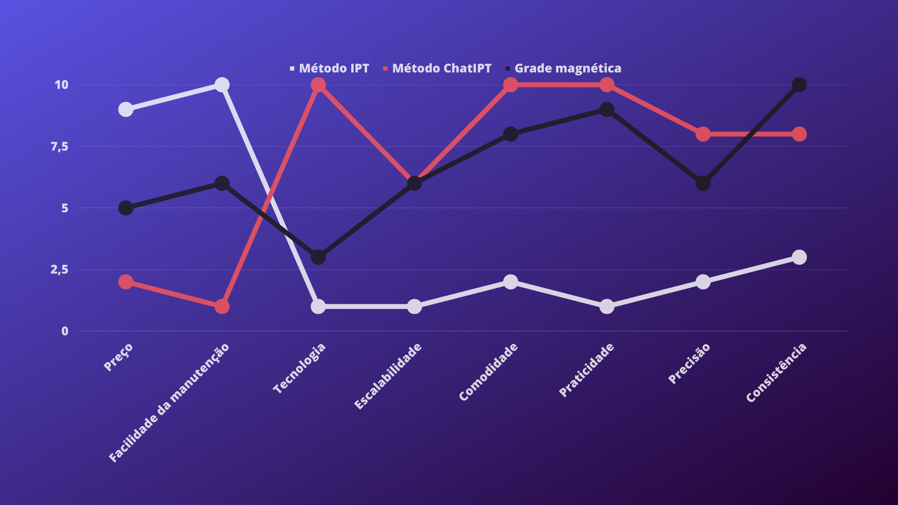
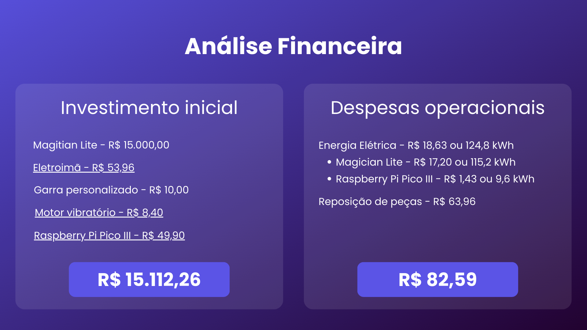
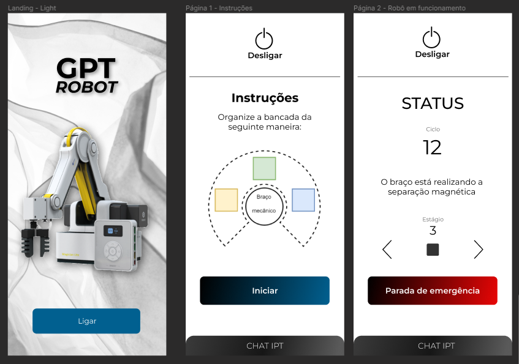

<table>
<tr>
<td>

</td>
<td>
</td>
</tr>
</table>

Concepção de sistema de automação industrial

>*Observação 1: A estrutura inicial deste documento é só um exemplo. O seu grupo deverá alterar esta estrutura de acordo com o que está sendo solicitado nos artefatos.*

>*Observação 2: O índice abaixo não precisa ser editado se você utilizar o Visual Studio Code com a extensão **Markdown All in One**. Essa extensão atualiza o índice automaticamente quando o arquivo é salvo.*

**Conteúdo**

- [Autores](#autores)
- [Visão Geral do Projeto](#visão-geral-do-projeto)
  - [Empresa](#empresa)
  - [O Problema](#o-problema)
  - [Objetivos](#objetivos)
    - [Objetivos gerais](#objetivos-gerais)
    - [Objetivos específicos](#objetivos-específicos)
  - [Partes interessadas](#partes-interessadas)
  - [Análise do cenário: Matriz SWOT](#análise-do-cenário-matriz-swot)
  - [Proposta de Valor: Value Proposition Canvas](#proposta-de-valor-value-proposition-canvas)
  - [Matriz de Risco](#matriz-de-risco)
  - [Oceano Azul](#oceano-azul)
  - [Análise Financeira](#análise-financeira)
- [Requisitos do Sistema](#requisitos-do-sistema)
  - [Personas](#personas)
  - [Histórias dos usuários (user stories)](#histórias-dos-usuários-user-stories)
- [Arquitetura do Sistema](#arquitetura-do-sistema)
  - [Módulos do Sistema e Visão Geral (Big Picture)](#módulos-do-sistema-e-visão-geral-big-picture)
  - [Descrição dos Subsistemas](#descrição-dos-subsistemas)
    - [Requisitos de software](#requisitos-de-software)
  - [Tecnologias Utilizadas](#tecnologias-utilizadas)
- [UX e UI Design](#ux-e-ui-design)
  - [Wireframe + Storyboard](#wireframe--storyboard)
  - [Design de Interface - Guia de Estilos](#design-de-interface---guia-de-estilos)
- [Testes de Hardware](#testes-de-hardware)
  - [Braço robótico](#braço-robótico)
    - [Alcance do braço](#alcance-do-braço)
    - [Conexão com servidor](#conexão-com-servidor)
  - [Eletroímã](#eletroímã)
    - [Controle do campo magnético](#controle-do-campo-magnético)
    - [Potência do eletroímã satisfatória](#potência-do-eletroímã-satisfatória)
  - [Outros sensores](#outros-sensores)
    - [Célula de carga](#célula-de-carga)
    - [Vibrador aquático](#vibrador-aquático)
    - [Buzzer](#buzzer)
    - [LED](#led)
- [Manuais](#manuais)
  - [Manual de Implantação](#manual-de-implantação)
  - [Manual do Usuário](#manual-do-usuário)
  - [Manual do Administrador](#manual-do-administrador)
- [Referências](#referências)

# Autores

* Alysson Cordeiro
* Giovana Rodrigues Araujo
* Henrique Lemos Freire Matias
* Lucas Henrique Sales de Souza
* Lyorrei Shono Quintão
* Mihaell Brenno Alves
* Patricia Honorato Moreira

# Visão Geral do Projeto

## Empresa

*O IPT é o Instituto de Pesquisas Tecnológicas, vinculado à Secretaria de Desenvolvimento Econômico do Estado de São Paulo e há 123 anos colabora para o processo de desenvolvimento do País.*

## O Problema

*O processo de separação magnética atualmente é manual, apresentando riscos de agilidade e precisão ao processo. Além disso, a constância da distância é imprecisa, considerando que esse fator é essencial para o campo eletromagnético e o próprio campo aplicado sobre as partículas também é impreciso, dificultando a determinação do campo necessário para a separação dos minerais.*

## Objetivos

### Objetivos gerais

*Desenvolveremos um equipamento automatizado que tenha capacidade de aplicar um campo magnético constante, com intensidade e distância ajustáveis, ao longo de toda a amostra, promovendo, assim, uma separação dos minerais magnéticos, os quais serão depositados em um recipiente diferente dos minerais não magnéticos que permanecerão depositados na bandeja original.*

### Objetivos específicos

*<ul> <li> Controle do campo magnético sobre toda a amostra a fim de reduzir os erros de ensaio decorrentes da ação humana; </li> <li> Maior qualidade na execução do ensaio, principalmente no que tange a repetibilidade e reprodutibilidade; </li> <li> Maior flexibilidade de ensaios, pois o uso de eletroímãs ajustáveis dispensa a necessidade de se ter ímãs com o campo desejado; </li> <li> Determinação mais precisa do campo magnético adequado para diferentes ensaios. </li> </ul>*

## Partes interessadas

*Laboratório de Processos Metalúrgicos*

## Análise do cenário: Matriz SWOT

*Matriz_SWOT*

## Proposta de Valor: Value Proposition Canvas

*Value_Proposition_Canvas*
 

*Nossa proposta de valor envolve automatizar o processo de separação de metais que o IPT faz, sem alterar sua metodologia. Além disso, ela conta com um dispositivo magnético (um eletroimã) e um braço robótico (magician lite). Nesse sentido, nossa solução levará precisão no projeto, tendo em vista que não será necessária a alucação de recurso humano para o processo de separação (o qual possui um erro humano atrelado); consistência, visto que garantimos que a ciclicidade do processo seja completamente idêntica em todos os ciclos; escalabilidade devido à variabilidade que nossos produtos podem ter em questão de usos; porfim, automação ao processo, já que não será mais executado por humanos.*

## Matriz de Risco

*Matriz_de_risco*

## Oceano Azul

*Tendo em vista o gráfico acima, o qual compara nossa solução com o método tradicional e manual do IPT e com uma alternativa do mercado, a Grade Magnética, é necessário evidenciar 4 pontos importantes para nossa matriz de oceano azul:*
*<ul> <li> Primeiro, __aumentaremos__ a __consistência__ em relação aos métodos comparados, tendo em vista que o braço robótico, embora ajustável, executará todos os processos de maneira igual e consistente; </li> <li> Além disso, é evidente que precisamos __criar__, também, __facilidade na manutenção__ do hardware e do código que compõem o projeto; </li> <li> Outrossim, visto que o __preço__ de nossa solução é alto, precisamos encontrar formas de __reduzir__ esse fator; </li> <li> Por fim, __eliminaremos__ a necessidade de um __técnico de instalação__ do braço robótico por meio de um manual de instalação limpo e simples de compreender.</li>  </ul>*

## Análise Financeira

*Descrição da análise*

# Requisitos do Sistema

*Descrição_dos_requisitos*

## Personas

*Descrição da persona*

## Histórias dos usuários (user stories)

*Descrição_das_histórias_dos_usuários*

# Arquitetura do Sistema

## Módulos do Sistema e Visão Geral (Big Picture)

## Descrição dos Subsistemas

### Requisitos de software

## Tecnologias Utilizadas

# UX e UI Design

## Wireframe + Storyboard

*O Wireframe para nossa aplicação web, por enquanto (SPRINT2), consiste em 3 (três) páginas de um aplicativo que será desenvolvido em Flutter.*

*<ul> <li>A primeira página funciona como uma página inicial para o aplicativo, em que há um botão "Ligar" que ligará o braço robótico;</li> <li>A segunda página consiste em instruções para o usuário organizar as bandejas, de forma que o braço robótico reconheça cada uma;</li> <li>Por último, a terceira constitui-se de uma página dinâmica que apresenta o status em tempo real, com a opção de pular uma etapa do processo ou encerrá-lo imediatamente.</li> </ul>*

## Design de Interface - Guia de Estilos

# Testes de Hardware

## Braço robótico

### Alcance do braço
Primeiramente testamos se o braço robótico possui alcance suficiente para trabalhar nas três bandejas.

Os testes foram bem sucedidos, como pode ser visto no vídeo abaixo:
<!-- vídeo com o teste -->

### Conexão com servidor
Ainda é necessário testar se é possível instanciar um servidor que se comunique com o braço para executar códigos que mexam ele.

## Eletroímã

### Controle do campo magnético
Testamos se é possível controlar o campo magnético do eltroímã pelo raspberry pi pico.

Assim como o vídeo abaixo, o teste foi bem sucedido:
<!-- vídeo com o teste -->

### Potência do eletroímã satisfatória
Precisamos testar se o eletroímã tem potência suficiente para criar um campo magnético satisfatório que consiga pegar os materiais magnéticos nas bandejas.

## Outros sensores

### Célula de carga
Ainda está em fase de testes

### Vibrador aquático
Ainda está em fase de testes

### Buzzer
Ainda está em fase de testes, mas sabemos que não é difícil utilizá-lo.

### LED
Ainda está em fase de testes, mas sabemos que não é difícil controlá-los.

# Manuais

## Manual de Implantação

## Manual do Usuário

## Manual do Administrador

# Referências
