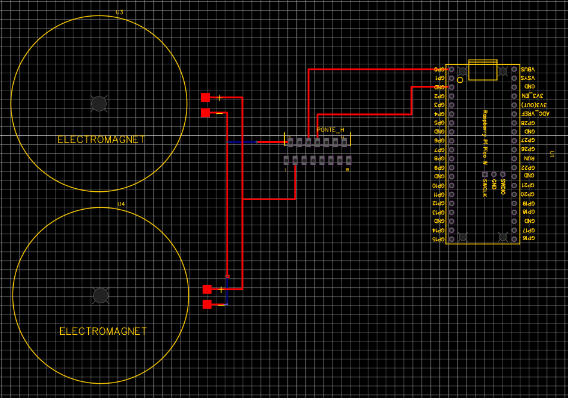

<table>
<tr>
<td>

</td>
<td>
</td>
</tr>
</table>

Concepção de sistema de automação industrial

> _Observação 1: A estrutura inicial deste documento é só um exemplo. O seu grupo deverá alterar esta estrutura de acordo com o que está sendo solicitado nos artefatos._

> _Observação 2: O índice abaixo não precisa ser editado se você utilizar o Visual Studio Code com a extensão **Markdown All in One**. Essa extensão atualiza o índice automaticamente quando o arquivo é salvo._

**Conteúdo**

-   [Autores](#autores)
-   [Visão Geral do Projeto](#visão-geral-do-projeto)
    -   [Empresa](#empresa)
    -   [O Problema](#o-problema)
    -   [Objetivos](#objetivos)
        -   [Objetivos gerais](#objetivos-gerais)
        -   [Objetivos específicos](#objetivos-específicos)
    -   [Partes interessadas](#partes-interessadas)
    -   [Análise do cenário: Matriz SWOT](#análise-do-cenário-matriz-swot)
    -   [Proposta de Valor: Value Proposition Canvas](#proposta-de-valor-value-proposition-canvas)
    -   [Matriz de Risco](#matriz-de-risco)
    -   [Oceano Azul](#oceano-azul)
    -   [Análise Financeira](#análise-financeira)
-   [Requisitos do Sistema](#requisitos-do-sistema)
    -   [Personas](#personas)
    -   [Mapa de Jornada do Usuário](#mapa-de-jornada-do-usuário)
    -   [Histórias dos usuários (user stories)](#histórias-dos-usuários-user-stories)
-   [Arquitetura do Sistema](#arquitetura-do-sistema)
    -   [Módulos do Sistema e Visão Geral (Big Picture)](#módulos-do-sistema-e-visão-geral-big-picture)
        -   [Croqui](#croqui)
        -   [Diagrama da solução](#diagrama-da-solução)
    -   [Descrição dos Subsistemas](#descrição-dos-subsistemas)
        -   [Requisitos de software](#requisitos-de-software)
    -   [Tecnologias Utilizadas](#tecnologias-utilizadas)
-   [UX e UI Design](#ux-e-ui-design)
    -   [Frontend + Storyboard](#frontend--storyboard)
-   [Testes de Hardware](#testes-de-hardware)
    -   [Braço robótico](#braço-robótico)
        -   [Alcance do braço](#alcance-do-braço)
        -   [Posicionamento das bandejas](#posicionamento-das-bandejas)
        -   [Conexão com servidor](#conexão-com-servidor)
    -   [Eletroímã](#eletroímã)
        -   [Controle do eletroímã](#controle-do-eletroímã)
        -   [Controle de potência do eletroímã](#controle-de-potência-do-eletroímã)
    -   [Outros sensores](#outros-sensores)
        -   [Célula de carga](#célula-de-carga)
        -   [Mini Bomba Motor D'água](#mini-bomba-motor-dágua)
        -   [Sensor de distância ultrassônico](#sensor-de-distância-ultrassônico)
        -   [Buzzer](#buzzer)
-   [Backend](#backend)      
-   [Frontend](#frontend)      
-   [Requisitos de conectividade](#requisitos-de-conectividade)      
-   [Dispositivo Eletrônico](#dispositivo-eletrônico)
    -   [Esquemático](#esquemático)
        -   [Identificação das ligações](#identificação-das-ligações)
    -   [Layout da placa](#layout-da-placa)
-   [Dispositivos Mecânicos](#dispositivos-mecânicos)
    -   [Lista de Peças](#lista-de-peças)
    -   [Lista de Materiais](#lista-de-materiais)
    -   [Desenho Técnico](#desenho-técnico)
        -   [Suporte para a Célula de Carga](#suporte-para-a-célula-de-carga)
        -   [Suporte para o Eletroímã](#suporte-para-o-eletroímã)
            -   [Base](#base)
            -   [Tampa](#tampa)
    -   [Modelagem 3D](#modelagem-3d)
        -   [Suporte para Eletroímã](#suporte-para-eletroímã)
            -   [Base](#base-1)
            -   [Tampa](#tampa-1)
    -   [Planejamento do Método de Fabricação](#planejamento-do-método-de-fabricação)
        -   [Suporte Célula de Carga](#suporte-célula-de-carga)
        -   [Base suporte para Eletroímã](#base-suporte-para-eletroímã)
        -   [Tampa suporte para Eletroímã](#tampa-suporte-para-eletroímã)
        -   [Base para os componentes eletrônicos](#base-para-os-componentes-eletrônicos)
    -   [**Lista de Materiais**](#lista-de-materiais-1)
    -   
-   [**Planejamento do Método de Fabricação**](#planejamento-do-método-de-fabricação-1)
    -   [Manual do Usuário](#manual-do-usuário)
    -   [Manual do Administrador](#manual-do-administrador)
-   [Referências](#referências)

# Autores

-   Alysson Cordeiro
-   Giovana Rodrigues Araujo
-   Henrique Lemos Freire Matias
-   Lucas Henrique Sales de Souza
-   Lyorrei Shono Quintão
-   Mihaell Brenno Alves
-   Patricia Honorato Moreira

# Visão Geral do Projeto

## Empresa

O IPT é o Instituto de Pesquisas Tecnológicas, vinculado à Secretaria de Desenvolvimento Econômico do Estado de São Paulo e há 123 anos colabora para o processo de desenvolvimento do País.

## O Problema

O processo de separação de minerais realizado pelo IPT é manual, executado por meio de um técnico operador, que aproxima uma barra de ímã de ferrite, envolto em um saco plástico, do material que está submerso e espalhado em um recipente com água.

Nessa etapa, o operador aproxima o íma sobre um primeiro recipiente que contém toda a amostra, para em seguida, em um segundo recipiente, limpar as impurezas contidas na amostra. Por fim os minerais são depositados em um recipiente final, que também contém água.

Infere-se que esse processo é impreciso, sendo realizado diversas vezes e demandando treinamento apropriado do operador. Os metais não são totalmente retirados na primeira passagem pelo ferromagnético, em suma pela imprecisão do campo magnético do eletroímã devido a distância de manipulação, mas também pela necessidade de se testar diferentes campos por meio da troca de ímãs.

## Objetivos

### Objetivos gerais

Desenvolveremos um equipamento automatizado que tenha capacidade de aplicar um campo magnético constante, com intensidade e distância ajustáveis, ao longo de toda a amostra, promovendo, assim, uma separação dos minerais magnéticos, os quais serão depositados em um recipiente diferente dos minerais não magnéticos que permanecerão depositados na bandeja original.

### Objetivos específicos

<ul> <li> Controle do campo magnético sobre toda a amostra a fim de reduzir os erros de ensaio decorrentes da ação humana; </li> <li> Maior qualidade na execução do ensaio, principalmente no que tange a repetibilidade e reprodutibilidade; </li> <li> Maior flexibilidade de ensaios, pois o uso de eletroímãs ajustáveis dispensa a necessidade de se ter ímãs com o campo desejado; </li> <li> Determinação mais precisa do campo magnético adequado para diferentes ensaios. </li> </ul>

## Partes interessadas

-   IPT;
-   Laboratório de Processos Metalúrgicos;
-   Inteli.

## Análise do cenário: Matriz SWOT

## Proposta de Valor: Value Proposition Canvas

 

Nossa proposta de valor envolve automatizar o processo de separação de metais que o IPT faz, sem alterar sua metodologia. Além disso, ela conta com um dispositivo magnético (um eletroimã) e um braço robótico (magician lite). Nesse sentido, nossa solução levará precisão no projeto, tendo em vista que não será necessária a alucação de recurso humano para o processo de separação (o qual possui um erro humano atrelado); consistência, visto que garantimos que a ciclicidade do processo seja completamente idêntica em todos os ciclos; escalabilidade devido à variabilidade que nossos produtos podem ter em questão de usos; porfim, automação ao processo, já que não será mais executado por humanos.

## Matriz de Risco

RISCOS

-   Planejar um escopo maior do que o possível de entregar - Probabilidade: Médio; Impacto: Alta
-   Não entregar o projeto completo (integração com web app e tal) Médio Muito Alta
-   Falta de acesso a um teste real poderá prejudicar a criação de um produto escalável - Probabilidade: Muito Alta; Impacto: Baixo
-   Demandar muito tempo para determinadas atividades do projeto e negligenciar outras (como na configuração microcontrolador para a web application ou no frontend do serviço) - Probabilidade: Baixo; Impacto: Alta
-   Parâmetros de medidas para relatórios de ensaio não bem definidos - Probabilidade: Baixo; Impacto: Muito Alta
-   Não ter a participação de todos no desenvolvimento do frontend e backend - Probabilidade: Alta; Impacto: Médio
-   Desacordo do grupo nas ferramentas utilizadas - Probabilidade: Muito Baixo; Impacto: Muito Baixo
-   Ausência de integrantes do grupo nos desenvolvimentos - Probabilidade: Baixo; Impacto: Médio
-   Dias das instruções de programação incompatíveis com o tempo de desenvolvimento desejado para entregas da SPRINT - Probabilidade: Médio; Impacto: Médio
-   Erro na construção da peça de encaixe para o braço robôtico - Probabilidade: Médio; Impacto: Muito Alta

OPORTUNIDADES

-   Suporte do inteli e professores altamente qualificados - Probabilidade: Muito Alta; Impacto: Muito Alta
-   IPT ser um parceiro muito acessível e amigável em geral - Probabilidade: Alta; Impacto: Muito Alta
-   IPT ter conhecimento técnico e científico sobre o problema que estamos prototipando uma solução, nos auxiliará na resolução de possíveis dúvidas e sugestões de melhorias - Probabilidade: Baixo; Impacto: Alta
-   Desenvolver uma tecnologia escalável - Probabilidade: Médio; Impacto: Muito Alta
-   Curva de aprendizado do python ser muito simples - Probabilidade: Médio; Impacto: Alta

## Oceano Azul

Tendo em vista o gráfico acima, o qual compara nossa solução com o método tradicional e manual do IPT e com uma alternativa do mercado, a Grade Magnética, é necessário evidenciar 4 pontos importantes para nossa matriz de oceano azul:

<ul> <li> Primeiro, __aumentaremos__ a __consistência__ em relação aos métodos comparados, tendo em vista que o braço robótico, embora ajustável, executará todos os processos de maneira igual e consistente; </li> <li> Além disso, é evidente que precisamos __criar__, também, __facilidade na manutenção__ do hardware e do código que compõem o projeto; </li> <li> Outrossim, visto que o __preço__ de nossa solução é alto, precisamos encontrar formas de __reduzir__ esse fator; </li> <li> Por fim, __eliminaremos__ a necessidade de um __técnico de instalação__ do braço robótico por meio de um manual de instalação limpo e simples de compreender.</li>  </ul>

## Análise Financeira

Nessa primeira análise, pode-se notar que, com um investimento inicial de R$15.112,26 (quinze mil, cento e doze reais e vinte e seis centavos), nossa solução pode já ser implementada no ambiente de separação de metais do IPT. Além disso, prevemos despesas operacionais que podem estar relacionadas com o valor da energia que os esquipamentos utilizam e com a reposição das peças que mais posuem chance de quebrar após um ano de uso com poucos cuidados.

# Requisitos do Sistema

_Descrição_dos_requisitos_

## Personas

_Descrição da persona_

## Mapa de Jornada do Usuário

## Histórias dos usuários (user stories)

-   Eu, como técnico, quero poder automatizar a tarefa de manipulação de amostra de metais, para que eu possa alocar meu tempo em atividades mais valiosas.
-   Eu, como técnico, quero poder delegar a tarefa repetitiva de separação metálica para um braço mecânico, a fim de evitar o desgaste físico e mental que esse processo manual e repetitivo causa.
-   Eu, como técnico, gostaria de utilizar um braço mecânico preciso e confiável, para que eu possa realizar a tarefa de separação dos metais com eficiência e precisão, sem comprometer a qualidade dos resultados.
-   Eu, como técnico, quero poder anexar o braço mecânico à minha estação de trabalho, para que possa automatizar a separação de liga metálica da amostra através de um processo magnético.
-   Eu, como técnico, quero ter uma interface física, para controlar a movimentação precisa do braço mecânico.
-   Eu, como técnico, quero ter uma estrutura fácil de manutenção para garantir que o dispositivo possa ser mantido em boas condições de funcionamento ao longo do tempo.
-   Eu, como técnico, quero ter um encaixe para o braço mecânico criado a partir de modelagem 3D, para que possa garantir que o braço tenha uma interação perfeita com restante da estação e não prejudique o processo de separação de liga metálica.

# Arquitetura do Sistema

## Módulos do Sistema e Visão Geral (Big Picture)

### Croqui

_Descrição do croqui_

### Diagrama da solução

_Descrição do diagrama_

## Descrição dos Subsistemas

### Requisitos de software

## Tecnologias Utilizadas

# UX e UI Design

## Frontend + Storyboard

A nossa aplicação web, por enquanto (SPRINT3), consiste em 3 (três) páginas de um aplicativo desenvolvido em Flutter.

-   A primeira página funciona como uma página inicial para o aplicativo, em que há um botão "Ligar" que ligará o braço robótico;
-   A segunda página consiste em instruções para o usuário organizar as bandejas. Além disso, há um botão "iniciar" que começa o processo de separação de metais com o braço robótico.
-   Por último, a terceira constitui-se de uma página dinâmica que apresenta o status em tempo real do processo de separação magnética, com os seguintes botões para controlar o robô: pausar processo, voltar estágio, avançar estágio, parada de emergência e desligar.

# Testes de Hardware

## Braço robótico

A primeira item que analisamos no braço foi a seu tipo de conexão. A forma de conexão que iniciamente é a mais fácil é via usb. Através disso, o conectamos a um notebook, e via uma biblioteca em python conseguimos solicitar movimentos e utilizar todas as suas ferramentas. Os primeiro testes então ocorreram a partir desse tipo de conexão mas almejamos solicitar essas atividades através de um microcontrolador.

### Alcance do braço

Primeiramente, seguindo o esquema de conexão mencionado anteriormente, testamos se o braço robótico possui alcance suficiente para trabalhar nas três bandejas. Para esse teste, alteramos manualmente no script a posição que estávamos solicitando para que o braço fosse sem alterar a sua altura. Assim que encontrávamos o ponto máximo para cada lado de movimento do braço, realizávamos a sua demarcação na mesa com uma caneta.
Os testes foram bem sucedidos, como pode ser visto no vídeo abaixo: [Teste sobre o alcance do braço.](https://user-images.githubusercontent.com/99269584/221435514-a22eae79-256b-4c16-8d6d-9cd2edccdae1.mp4)

<!-- vídeo com o teste -->

### Posicionamento das bandejas

Com o limite de operação do braço delimitado, posicionamos as bandejas dentro desse espaço e marcamos a distância que as bandejas deveriam ficar do braço para futuros teste.

<!-- Foto das bandejas -->

Logo em seguida, manualmente alterávamos no script as posições que o braço deveria trabalhar em cada canto da bandeja e a altura adequada também. A partir disso, consumíamos dessas demarcações dos cantos dos recipientes para realizar a movimentação adequada do braço simulando a passagem do imã.

<!-- Vídeo dessa execução -->

Após a primeira passagem, verificamos que seria necessário a elevação da bandeja para um melhor contato com o imã. Assim, colocamos uma outra bandeja debaixo da primeira. Dessa maneira, conseguimos também posicionar a célula de carga abaixo da bandeja para coletar os dados de massa futuramente também.

<!-- Vídeos dessa nova execução -->

### Conexão com servidor

Planejamos criar um servidor que conseguirá receber requisições e se comunicar diretamente com o braço mecânico, executando movimentações e entendendo o status do processo de separação em tempo real. Esse servidor inicialmente estará rodando em um computador ligado via cabo ao braço, mas almejamos transportar esse servidor para um microcontrolador visando uma maior comodidade para o nosso usuário.

-   Atualização sprint 3:  
    Conseguimos criar um servidor embarcado no Raspberry Pi Pico W, o qual tinha a funcionalidade de receber um valor via uma requisição http que continha o valor que queríamos acionar o PWM. Os teste estam descritos da seção de testes do imã abaixo. O código da feature descrita pode ser encontrada em `src/embedded/websocketserver.py` .

## Eletroímã

Um eletroímã utiliza corrente elétrica para gerar um campo magnético. Nesse projeto realizaremos o controle do eletroímã por meio do sinal PWM (modulação por largura de pulso), o qual possibilita controlar a força do campo magnético por meio da quantidade de energia que se é entregue ao sistema. Esperamos controlar a intensidade do imã para facilitar a separação de materiais magnéticos.

### Controle do eletroímã

O primeiro teste realizado com eletroímã controlado pelo raspberry pi pico W, foi o de ligar e desligar o ímã. Para isso, conectamos o eletroímã a ponte H, um circuito eletrônico que controla a velocidade do motor variando a largura dos pulsos do sinal PWM.

Ademais, nesse circuito, o eletroímã conectado a ponte H, é controlado pelo pino 0 do rapsberry pi pico W. Ao definir-se o valor de 0 no código, o eletroímã liga, e com 1, o eletroímã é desligado. Nesse ciclo o eletroímã liga por 1s e depois desliga por 1s. Na montagem realizada para este projeto, a ponte H recebe alimentação por uma fonte de 5v.

No vídeo a seguir, se é demonstrado o teste realizado com uma moeda, que consistiu na montagem do eletroímã no braço robótico:
https://user-images.githubusercontent.com/99269584/221374609-9ee725ef-596e-4a0a-968d-72518479a653.mp4

### Controle de potência do eletroímã

Para realizar-se o teste de variação de força do campo magnético, delimitou-se uma rampa variando os valores do PWM de 0 até o máximo 65536, variando-se a largura do pulso de forma linear ao longo do tempo. Modificando-se a largura do pulso do sinal PWM, é possível controlar a corrente que passa pelo eletroímã, e portanto, controlar sua força magnética.

No teste realizado com uma moeda, o intervalo de tempo aplicado foi de 1ms, e observou-se que quanto mais próximo do valor máximo, maior era a aderância da moeda ao eletroímã.

Assim, por meio do teste, infere-se a possibilidade de implementação do sistema de controle da intensidade do eletroímã por meio da interface web desenvolvida, visto que os materiais magnéticos necessitam da aplicabilidade de diferentes intensidades no eletroímã para melhor aderência.

#### _Controle de potência do eletroímã através de um servidor_

-   Foi desenvolvido um servidor embarcado no Raspberry Pi Pico W, o qual recebia uma chamada http em uma porta que decidimos (no exemplo abaixo é a 80) um JSON. O código consistia em ficar em um while loop procurando por chamadas. Quando a recebia, fazia um loop para pegar os últimos caracteres das informações contidas na chamada http. Esse últimos caracteres eram delimitados entre '{' e '}', os quais representam o ínicio e o fim do JSON transmitido. Assim, armazenamos um JSON em formato de string em uma variável e utilizamos o método `.loads` da biblioteca `json` para converter a string em um JSON.  
     
    <i>Demonstração do código recebendo e estraindo o valor inserido no JSON</i>  
     A partir desse valor recebido, o passamos para o pwm o qual foi configurado da seguinte forma:
    
    E o imã então é ligado a partir desse linha:
      
     Nos teste que executamos, utilizamos o `Postman` para mandar os valores que queríamos que o imã fosse ligado.
    <i>Demonstração de como os dados eram enviados ao raspberry</i>  
    No teste realizado, obervasse o funcionamento do circuito com alimentação de 10V para ponte H. O eletroímã é acionado via valores enviados pelo backend, a conexão com o Rapsberry Pi Pico W é feita via cabo USB. 
https://user-images.githubusercontent.com/99269584/227998601-90640557-b044-4615-bfa4-ae840086af07.mp4
    

## Outros sensores

### Célula de carga

A célula de carga é utilizada para a medição de massa. Ela consiste em um dispositivo que, sob efeito de uma carga, se deforma, mas que volta a posição inicial por possuir um certo nível de elasticidade, já que é composta de aço ou alumínio. Esse movimento também é reproduzido por extensiômetros fixados ao dispositivo. Os extensiômetros são condutores elétricos que ao serem alongados ou comprimidos variam sua resistência, assim, somos capazes de determinar essa pequena deformação e traduzí-las por meio de um amplificador HX711.

<i>Fonte:</i> <a href="https://www.flintec.com/br/sensores-de-peso/celulas-de-carga/como-funciona-uma-c%C3%A9lula-de-carga"><i>Flintec</i></a>

<i>Fonte:</i> <a href="https://www.flintec.com/br/sensores-de-peso/celulas-de-carga/como-funciona-uma-c%C3%A9lula-de-carga"><i>Flintec</i></a>

No projeto atual, o sensor de peso tem o objetivo de identificar a quantidade de material retirado pelo braço robótico, para que esse não seja sobrecarregado, já que sua força suporta até 250g. A célula de carga deverá ser posicionada abaixo da primeira bandeja e, através de um algoritmo, a diferença de massa entre o ínicio do movimento do braço e os instantes futuros determinará a quantidade de material retirado.

Atualmente, apenas a ligação entre o dispositivo e o amplificador foram feitas, contudo, futuramente, serão contruídas as bases para a célula, sua calibração e implementação do algoritmo.

### Mini Bomba Motor D'água

Este atuador é usado para misturar a amostra na água em alguns momentos durante o processo de separação. É um componente utilizado para pressurizar, circular ou bombear água, dependendo da necessidade contextual do projeto. Em nosso caso, após o braço ter concluído o circuito na primeira bandeja, onde a bomba estará localizada, ela será ligada. Isso fará com que a água circule na primeira bandeja, iniciando o processo de mistura da amostra, garantindo uma maior qualidade nos testes ao evitar que materiais mais pesados fiquem depositados no fundo da bandeja.

Atualmente, tivemos problemas com o funcionamento do dispositivo. Em entregas futuras os primeiros testes e implementações serão feitos.

### Sensor de distância ultrassônico

O sensor de distância ultrassônico é comumente utilizado para medir distâncias e evitar colisões. O seu princípio de funcionamento se baseia na emissão de um pequeno pulso sonoro de alta frequência que se propagará na velocidade do som no meio em que estiver inserido. Quando esse pulso atingir um objeto que estiver em sua trajetória um sinal de eco será refletido para o sensor. A partir disso, é possível de medir a distância do sensor até o objeto por meio do tempo entre a emissão e a recepção, e a velociade do som no meio em que foi emitida.

O sensor de distância ultrassônico é comumente utilizado para medir distâncias e evitar colisões. O seu princípio de funcionamento se baseia na emissão de um pequeno pulso sonoro de alta frequência que se propagará na velocidade do som no meio em que estiver inserido. Quando esse pulso atingir um objeto que estiver em sua trajetória um sinal de eco será refletido para o sensor. A partir disso, é possível de medir a distância do sensor até o objeto por meio do tempo entre a emissão e a recepção, e a velociade do som no meio em que foi emitida.

<i>Fonte:</i> <a href="https://www.docsity.com/pt/datasheet-sensor-ultrassonico/4938269/"><i>Docsity</i></a>

No projeto atual, esse sensor tem o objetivo de identificar a altura em que o braço está trabalhando e evitar possíveis colisões desse com obstáculos inesperados. Esse sensor deve ser posicionado logo abaixo do braço. Um algoritmo será desenvolvido para calcular a distância e realizar os movimentos necessários a partir de então.
O teste realiazado no vídeo a seguir, demonstra o funcionamento do sensor para determinar a distância: https://user-images.githubusercontent.com/99269584/221436545-522fa7b0-bcdd-4d4e-8931-6d5904714fe5.mp4

### Buzzer

Será testado na próxima sprint quando o rapsberry pi pico for integrado com o braço robótico e interface web.

## Tabela de testes

| Componentes                          | Entrada                                                    | Saída esperada                                                                                                   | Resultado                                                                                                                            |
| :----------------------------------- | :--------------------------------------------------------- | :--------------------------------------------------------------------------------------------------------------- | :----------------------------------------------------------------------------------------------------------------------------------- |
| Braço robótico                       | Ativação por meio do aplicativo.                           | Movimentação feita corretamente pelas bandeja.                                                                   | Percorreu todas as bandejas sem esbarrar ou travar.                                                                                  |
| Eletroímã                            | Pelo código, inserção de diversos níveis de intensidade.)  | Mudança da intensidade da atração do ímã proporcional ao valor inserido.                                         | Tudo correto, o ímã mudou sua intensidade, contudo, a variável inserida não está em Gauss, logo, a conversão deve ser realizada.     |
| Bomba d'água                         | Conexão com uma fonte de 5V.)                              | Acionamento da bomba.                                                                                            | Ao ser conectada com as polaridades invertidas, a bomba acabou por queimar.                                                          |
| Célula de carga e amplificador HX711 | Inserção de algum objeto sob a célula de carga.            | Demonstrar o valor da massa desse objeto.                                                                        | Os valores foram demonstrados, mas a balança não está calibrada, logo, uma conversão deve ser realizada por meio de um peso exemplo. |
| Sensor de distância ultrassônico     | Aproximação de algum objeto do sensor.                     | Demonstrar valores proporcionais a distância real entre o objeto e o sensor.                                     | Valores corretos foram mostrados em centímetros.                                                                                     |
| Aplicativo                           | Movimentação do robô pelas bandejas.                       | Exibição correta do estágio do processo e do ciclo.                                                              | A exibição foi feita corretamente.                                                                                                   |
| Aplicativo                           | Ativação do botão de pause pelo aplicativo.                | Parada do robô e permanência no estágio atual.                                                                   |                                                                                                                                      |
| Aplicativo                           | Ativação do botão de play pelo aplicativo.                 | Retorno da movimentação do estágio em que foi pausado.                                                           |                                                                                                                                      |
| Aplicativo                           | Ativação do botão de avanço pelo aplicativo.               | Avanço do estágio do processo, com o robô passando para a próxima bandeja e a mudança do estágio na interface.   |                                                                                                                                      |
| Aplicativo                           | Ativação do botão de retorno pelo aplicativo.              | Retorno do estágio do processo, com o robô passando para a bandeja anterior e a mudança do estágio na interface. |                                                                                                                                      |
| Aplicativo                           | Ativação do botão de parada de emergência pelo aplicativo. | Parada imediata do robô, depois, movimentação levemente para cima.                                               |                                                                                                                                      |

# Backend

O backend da aplicação está localizado na pasta src/backend/app.py. Esse arquivo, quando executado, inicia um servidor socket na porta 3001. Nesse mesmo arquivo, criamos uma instância da classe "Dobot", a qual está localizada na pasta src/backend/services/dobot.py. Nessa classe, estão definidos diversas funções que utilizam da biblioteca "pydobot" para executar comandos no robô. No arquivo app.py, fazemos subscribe em diversos tópicos socket, cada um responsável por algum tipo de interação com o robô, ou seja, cada um chamando diferentes funções da classe Dobot.
 
 
Segue a explicação de cada tópico:

<ul>
  <li>Connect: apenas faz um print no console mostrando que o cliente (aplicativo) conseguiu se conectar com o socket</li>
  <li>
    dobot_connect: Responsável por se conectar com o robô, por meio da função start_connection() definida na classe Dobot.  
    Esse tópico é executado quando o usuário pressiona o botão "Iniciar" da segunda página:
    
  </li>
   <li>
    start_cycle: Responsável por iniciar o processo de separação. Nesse tópico é feito um loop que executa a função movement definida na classe Dobot. Essa função é responsável por movimentar o robô por todos os seus estágios e ciclos.
     
    Esse tópico é executado automaticamente quando o usuário entra na página 3:
    
  </li>
  <li>
    stop: Responsável por pausar o processo de separação. 
     
    Esse tópico é executado quando o usuário pressiona o botão stop na página 3:
    
  </li>
  <li>
    reactivate: Responsável por retomar o processo de separação. 
     
    Esse tópico é executado quando o usuário pressiona o botão play na página 3:
    
  </li>
  <li>
    emergency_stop: Responsável por parar completamente o processo de separação. 
     
    Esse tópico é executado quando o usuário pressiona o botão "Parada de emergência" na página 3:
    
  </li>
  <li>
    advance_stage: Responsável por passar o processo de separação para o próximo ciclo. 
  </li>
  <li>
    previous_stage: Responsável por passar o processo de separação para o ciclo anterior. 
  </li>
  <li>
    disconnect: tópico executado quando o cliente se desconecta do socket. Nele, executamos a mesma função de parada de emergência do robô. 
  </li>
</ul>

# Frontend
O frontend do projeto que desenvolvemos em Flutter e Dart é uma parte crucial do projeto. Ele é responsável por apresentar as informações e funcionalidades para o usuário de maneira clara e intuitiva, sendo composto por três páginas que desempenham diferentes funções.

A primeira página é apenas uma página placeholder, ou seja, uma introdução que não apresenta nenhum conteúdo relevante. Ela serve apenas para dar uma ideia geral do que o aplicativo se trata.

A segunda página é onde o usuário pode ver como deve ser posicionado o robô e as bandejas para o processo de separação magnética. Além disso, há um botão que inicia o processo. Ela é fundamental para o usuário entender como deve ser feita a montagem do equipamento e iniciar a operação.

A terceira página é o acompanhamento em tempo real do processo. Além disso, ela possui botões que permitem executar funções no robô que está realizando o processo, como a parada de emergência, pausa, play, passar o processo para o próximo estágio, voltar o estágio e desligar o robô. Esses botões são importantes para dar ao usuário o controle total sobre a operação e garantir que ele possa pará-la ou modificá-la a qualquer momento.

Ao final da sprint 5, planejamos compilar o aplicativo e criar um APK para a utilização. Isso significa que o aplicativo será disponibilizado para download e poderá ser usado em dispositivos Android. Porém, é interessante ressaltar que aplicativos desenvolvidos em Flutter tem suporte tanto para IOS, quanto para Android. Cabe ao parceiro decidir qual formato é mais viável para o sistema em produção. Com o frontend bem desenvolvido e as funcionalidades implementadas, esperamos oferecer uma ótima experiência ao usuário e atender a todas as suas necessidades em relação ao processo de separação magnética.

# Requisitos de conectividade
O projeto apresentado requer uma conectividade estável e confiável entre todas as partes envolvidas, para garantir que as informações e comandos possam ser transmitidos de forma eficiente e segura.

Em primeiro lugar, o backend do sistema precisa ser executado em um computador com recursos adequados para rotear a rede wifi e estabelecer uma conexão socket. É importante que o computador seja capaz de processar grandes quantidades de dados rapidamente, para garantir que as informações sejam transmitidas de forma eficiente entre o robô e o cliente.

Em segundo lugar, o cliente precisa estar na mesma rede wifi que o servidor para se conectar por socket e emitir eventos. Isso significa que a rede wifi precisa ter uma conexão estável e forte o suficiente para permitir a comunicação entre os dois dispositivos sem interrupções ou perda de dados.

Em síntese, é importante que todo o sistema esteja em uma rede local, que não precise estar conectada à internet para funcionar. Isso garante que as informações sejam mantidas seguras e protegidas, sem o risco de serem interceptadas por terceiros mal-intencionados. Com esses requisitos atendidos, o sistema poderá executar as tarefas de forma eficiente e segura, sem interrupções ou falhas na comunicação.

# Controle de movimentação

O controle de movimentação do braço robótico permite que o sistema determine a trajetória ideal do braço robótico com base nas dimensões da bandeja de amostras e suas posições na bancada. Com base no escopo do projeto descrito, podemos entender que o Robot Magician é usado para manusear três bandejas diferentes, cada uma com um conjunto diferente de tarefas a serem executadas.

Na primeira bandeja, sua altura é mais elevada que as demais para assegurar que não aconteçam erros na passagem, e o braço robótico é programado para passar com o eletroímã três vezes para garantir que todos os materiais magnéticos sejam coletados. Na segunda bandeja, o braço robótico passa apenas uma vez, mas é utilizado para limpar o material. Por fim, na terceira bandeja, o braço robótico despeja o material magnético coletado anteriormente na primeira bandeja. O objetivo é armanezar esse material para o técnico realizar análises posteriormente. 

No escopo descrito, o controle do Robot Magician é realizado por meio do front end, que permite que um técnico controle cada etapa do processo de manuseio das bandejas de amostras. No teste realizado, é possível observar a integração do sistema, com a passagem do braço robótico nas amostras e o controle feito pelo usuário via interface web: https://user-images.githubusercontent.com/99269584/228046923-2ec1882a-0378-4bec-870e-582873d45abb.mp4

# Dispositivo Eletrônico

A construção do um dispositivo eletrônico foi feito em uma placa de cobre, na qual o Raspberry Pi Pico foi soldado na placa e os componentes de ligação com os sensores foram parafusados e soldados na placa.

## Esquemático

<i>Esquemático</i>

### Identificação das ligações

| HX711 | Microcontrolador | Cor da ligação |
| :---- | :--------------- | :------------- |
| GND   | GND (porta 3)    | Preto          |
| DT    | GP2 (porta 4)    | Verde          |
| SCK   | GP3 (porta 5)    | Azul           |
| VCC   | VBUS (porta 40)  | Vermelho       |

| HX711 | Célula de carga | Cor da ligação |
| :---- | :-------------- | :------------- |
| E+    | Fio vermelho    | Rosa           |
| E-    | Fio preto       | Ciano          |
| A-    | Fio verde       | Laranja        |
| A+    | Fio branco      | Lilás          |

| Ponte H       | Regulador de tensão | Cor da ligação |
| :------------ | :------------------ | :------------- |
| GND (porta 8) | OUT-                | Preto          |
| VSS (porta 9) | OUT+                | Vermelho       |

| Ponte H | Eletroímas | Cor da ligação |
| :------ | :--------- | :------------- |
| OUT 1   | Negativo   | Preto          |
| OUT 2   | Positivo   | Vermelho       |

| Ponte H       | Microcontrolador | Cor da ligação |
| :------------ | :--------------- | :------------- |
| ENA (porta 6) | GP0 (porta 1)    | Amarelo        |

## Layout da placa

<i>Layout da placa</i>

## Montagem placa de cobre

A montagem da placa utilizada nesse projeto apresenta Raspberry Pi Pico W, ponte H e módulo HX711 soldados na placa. Também contém dois plugs banana fêmea que recebem VCC e GND para alimentar o circuito da ponte H. 

No teste realizado, o funcionamento do circuito é feito por meio da alimentação de 10V para ponte H e com conexão via cabo USB com o Rapsberry Pi Pico W. https://user-images.githubusercontent.com/99269584/227998601-90640557-b044-4615-bfa4-ae840086af07.mp4

# Dispositivos Mecânicos

Peças criadas para o suporte dos componentes eletrônicos.

## Lista de Peças

| Peça                         | Quantidade | Descrição                                                                                                                                          |
| :--------------------------- | :--------- | :------------------------------------------------------------------------------------------------------------------------------------------------- |
| Suporte da Célula de Carga   | 1          | Suporte necessário para o funcionamento correto do componente Célula de carga                                                                      |
| Base suporte para Eletroímã  | 1          | Peça inferior (base) onde os eletroímãs serão sustentados                                                                                          |
| Tampa suporte para Eletroímã | 1          | Peça superior (tampa) que será acoplada a base do suporte. A tampa terá uma haste para ser usada no braço robô assim como a caneta padrão do Dobot |
| Caixa protetora para Placa   | 1          | Caixa feita por um polímero onde ficará nossa placa, protegendo de impactos e certo nível de umidade                                               |

## Lista de Materiais

| Material                              | Descrição                                                                                                            |
| :------------------------------------ | :------------------------------------------------------------------------------------------------------------------- |
| Polímero (ainda não definido)         | Usada para a construção da Caixa Protetora para Placa e para o Suporte da Célula de Carga                            |
| ABS ou PA (Filamento de Impressão 3d) | Material plástico ou derivativo usado na impressão 3D. Os tipos escolhidos são ambos resistentes a certa temperatura |

## Desenho Técnico

### Suporte para a Célula de Carga

### Suporte para o Eletroímã

#### Base

#### Tampa

## Modelagem 3D

### Suporte para Eletroímã

#### Base

#### Tampa

### Primeira versão do suporte para eletroímã
 
 A primeira versão da base do eletroíma foi construída com o recorte de uma placa de cobre e montagem dos eletroímas parafusados. O eletroíma foi conectado aa ponte H por meio da extensão construída com fio de rede. 
 
 

## Planejamento do Método de Fabricação

### Suporte Célula de Carga

Para a construção do suporte da Célula de Carga, inicialmente, montamos um protótipo, separamos 4 tábuas retangulares de MDF (medidas acima em “**Desenho Técnico**”) e parafusamos elas no local separado no próprio componente. Na extremidade sinalizada com a seta para cima, uma das tábuas será localizada acima do componente. Na extremidade contrária, a outra tábua de MDF será parafusada abaixo do componente. As duas últimas tábuas, de largura menor, formam uma base posicionada transversalmente em relação ás tábuas principais, dando contra-peso a estrutura. Futuramente, a utilização de algum polímero, como acrílico ou pvc, substituirá as, atuais, peças de MDF.

<i>Imagem frontal/lateral</i>

<i>Imagem top-down</i>

### Base suporte para Eletroímã

A base de suporte para o Eletroímã consiste em uma caixa com a face superior aberta que segura os eletroímãs, sendo sustentado pela tampa dessa caixa. No centro há uma divisória de 4 pontas com um arco entre cada ponta adjacente, deixando o espaço necessário para os ímãs em formato de cilindro se encaixarem no suporte.

A partir da modelagem 3D da peça, iremos imprimir usando um filamento com a característica de resistência à temperatura, visto que nos testes do Eletroímã, notamos que apesar de baixa, houve aumento da temperatura ao usarmos por algum tempo. Ao pesquisar alguns materiais chegamos em 2 possíveis candidatos. São eles, o Nylon de Poliamida, um termoplástico semi-cristalino com baixa densidade e alta estabilidade térmica, e o ABS (**acrilonitrila butadieno estireno**) que possui a resistência ao calor semelhante

### Tampa suporte para Eletroímã

A tampa suporte para o eletroímã é a parte superior do conjunto de peças de suporte (base e tampa), ela tem a função de sustentar a base, conectar os fios do eletroímã ao controlador de potência, além de se acoplar ao robô através da haste cilíndrica similar a caneta padrão do dobot. Por se tratar de uma peça pertencente ao mesmo conjunto da peça anterior (Suporte ao Eletroímã), todas as informações dos planejamento de fabricação são as mesmas.

### Base para os componentes eletrônicos

#### Primeira versão base para os componentes eletrônicos
A primeira versão da base foi feita sem a soldagem dos componentes na placa de cobre perfurada, mas como os fios não poderia ficar soltos pelo riscos sd eperfuração e danos no circuito, elaborou-se uma base para a fixação foi criada por meio de uma placa de MDF. Porém, para ter uma vida útil melhor, essa placa deverá ser trocada por algum polímero e uma peça superior para a proteção será criada.

<i>Imagem top-down</i>

### Segunda versão base para os componentes eletrônicos

Na segunda versão da base, perfuramos a placa e parafusamos os componentes que não poderiam ser soldados. Também adicionamos dois conectores de plug banana para recebimento de alimentação na ponte H. E utilizamos um pote de plástico para proteger a placa de cobre perfurada. Os próximos incluem tampar o pote com uma tampa e realizar furos de diâmetro pequeno para passagem dos cabos de rede, fonte de alimentação dos plugs e cabo usb que conecta-se com o Rapsberry Pi Pico W.

## **Lista de Materiais**

1. **MICROCONTROLADOR:** o microcontrolador responsável pela atuação é o RASPBERRY PI PICO W com Wi-Fi RP2040 133MHZ detensão de alimentação é de 1.8-5.5v dc, cuja fabricante é a Newark Corporation, RS Components, Farnell element14. O microcontrolador será responsável pela intervenção entre a interface amigável e o braço robótico e seus adjacentes.
1. **BUZZER:** emissor de som de baixo custo, utilizado para reproduzir tanto efeitos sonoros simples, como também a capacidade de emitir sons mais complexos como músicas. Funciona com tensão entre 3,5 e 5V.
1. **PONTE H:** módulo ponte H L298N; 2 canais de 2A DC. Permite controlar a direção, velocidade e sentido de rotação de um motor elétrico. Servirá para controlar as rotações do braço robótico.
1. **ELETROÍMÃ:** usado eletroímã solenóide redondo de.\*\* Atrai e separa o material ferromagnético do restante da amostra.
1. **CONVERSOR AMPLIFICADOR:** responsável por traduzir os valores recebidos pela célula de carga para o microcontrolador. Foi usado um conversor amplificador HX711. Tensão de trabalho 2,6 V ~ 5,5 VDC, de corrente de trabalho abaixo de 10mA.

1. **CÉLULA DE CARGA:** É um sensor usado para medição de peso da amostra. Foi usado o sensor de 1kg.
1. **BOTÃO:** botão para iniciar as tarefas do robô.
1. **PCI:** a placa de circuito impresso (PCB) usada para conectar os componentes eletrônicos, como resistores, capacitores e, inclusive, usado para o microcontrolador. Vale ressaltar que a placa é universal e inflexível. Além do mais, no protótipo, foi usado a placa perfurada de 12cm x 18cm de material fenolite; marca: _piscaled_.
1. **COMPONENTE MOBILE:** será necessária, para interação com o robô, um celular com interface amigável.
1. **BANDEJA:** deve ser usado 3 bandejas de plástico seco para não ter interferência no eletroímã.
1. **BRAÇO ROBÓTICO:** automação responsável pela separação diretamente dos sedimentos magnéticos. É usado o braço robótico DOBOT MAGICIAN LITE da empresa Dobot company.

| **Representação** |              **Componentes**              | **Quantidade** | **Descrição**                                                                                                                            |
| :---------------- | :---------------------------------------: | :------------- | :--------------------------------------------------------------------------------------------------------------------------------------- |
|                   |   Raspberry Pi Pico W com conexão wifi    | 1              | Coletar e processar informações                                                                                                          |
|                   |         Placa de cobre perfurada          | 1              | Conectar, por meio da solda, todos os componentes.                                                                                       |
|                   |                  Ponte H                  | 1              | Permite controlar a direção, velocidade e sentido de rotação de um motor elétrico. Servirá para controlar as rotações do braço robótico. |
|                   |    Módulo Conversor Amplificador HX711    | 1              | Responsável por traduzir os valores recebidos pela célula de carga para o microcontrolador                                               |
|                   |                 Eletroímã                 | 4              | Atrai e separa o material ferromagnético do restante da amostra.                                                                         |
|                   |            Célula de carga 1kg            | 1              | Medir a massa da amostra.                                                                                                                |
|                   |            Dobot Magitian Lite            | 1              | Braço robótico utilizado na movimentação dos eletroímãs entre as bandejas.                                                               |
|                   |                  Buzzer                   | 1              | Anuncia o fim do procedimento.                                                                                                           |
|                   |                Push Button                | 1              | Inicia o procedimento.                                                                                                                   |
|                   |                 Bandejas                  | 3              | Utilizadas para o depósito da amostra, da limpeza do material e o depósito desse.                                                        |
|                   |       Polímero (ainda não definido)       |                | Estrutura feita a partir de tal material para o suporte da célula de carga.                                                              |
|                   |  Parafusos (tamanho ainda não definido)   | ≅ 2            | Usado na montagem da balança.                                                                                                            |
|                   |    Porcas (tamanho ainda não definido)    | ≅ 2            | Usada na montagem da balança.                                                                                                            |
|                   |   Arruelas (tamanho ainda não definido)   | ≅ 2            | Usada na montagem da balança.                                                                                                            |

##

# **Planejamento do Método de Fabricação**

No planejamento do método de fabricação, vamos dividir 3 etapas: a etapa número 1 será para componentes relacionados ao PCI, a etapa número 2 será para outros componentes com ponte H e o regulador de tensão e a etapa 3 montagem final dos hardwares.

1. Primeira etapa: pegue a placa de circuito impresso (PCI) de 12cm x 18cm. E coloque um conector para que possa conectar o Raspberry Pi Pico W. Veja o exemplo da imagem abaixo:

<i>Imagem 3.1: placa de circuito impresso (PCI) com conector.<i>

<i>Imagem 3.2: PCI com o Raspberry Pi Pico W<i>

<i>Imagem 3.3<i>

#

1. Em segundo passo, após encaixar o PCI na placa, solde o conector na placa com um jumpers: um na entrada; outro para o GND; e outros para os GPIOs.

Imagem 3.3: soldagem dos jumpers com o conector

1. Agora, vamos para a etapa número 2: primeiro, pegue a ponte H conecte um jumper no pino de entrada 5V. Em seguida, coloque um jumper no VCC, um no GND e outro no VLOGIC. E por fim, um fio na porta do OUT 1 na parte do MOTOR A. Veja o exemplo na imagem 3.4 e imagem 3.5:

%2022.38.23.jpg>)
<i>imagem 3.4<i>

#

1. Para o regulador de tensão, é simples: ligue a alimentação no borne de entrada, conectando a tensão positiva (2v - 24v DC) no IN+ e GND no IN-. Para visualizar a tensão de saída, conecte um multímetro no borne de saída (OUT+ e OUT-), na posição de medida de tensão contínua.

<i>Imagem 3.6: regulador de tensão step up.<i>

1. Para o conversor amplificador HX711 deverá ter 4 fios soldados nas portas E+, E-, A+ e A- . Nas pontas dos fios devem estar soldados entre eles para facilitar a conexão. Essa fiação conectará com a célula de carga, que detalharemos adiante no item 4. Guia de Instalação.

<i>Imagem 3.7: conversor amplificador.<i>

1. Agora, conecte os eletroímãs solenóides com o “_conector”_ de canetas do braço robótico.

<i>Imagem 3.8: eletroímãs desconectados.<i>

<i>Imagem 3.9: eletroímãs conectados com o suporte de canetas do braço robótico.<i>

<i>Imagem 3.10<i>

#

1. Conecte soldando a ponte H com os eletroímãs. Lembrando que a fiação que sai de um eletroimã deve estar conectado com VCC e GND juntos e outro eletroímã deve estar conectado com o fio do motor A: OUT 1.

<i>Imagem 3.10: conectando eletroímãs com a ponte H.<i>

#

1. Etapa 3: Para termos uma melhor experiência com a montagem, iremos usar um MDF para execução do programa.

_obs: o apoio com MDF não será permanente, será usado uma outro componente de apoio, a qual não comprometa com o hardware._

Imagem 3.11: MDF sendo medido para que possa ser colado e parafusados os componentes que outrora montamos.

Imagem 3.12: célula de peso no MDF.

Imagem 3.13: conectando o microprocessador com a ponte H, conversor amplificador e regulador de tensão.

Imagem 3.14: montagem completa do hardware..

#

## Manual do Usuário

## Manual do Administrador

# Referências

<!--
Modelo:
TÍTULO da matéria. Nome do site, ano. Disponível em: <URL>. Acesso em: dia, mês e ano.
ou
SOBRENOME, Nome. Título da matéria. Nome do site, ano. Disponível em: <URL>. Acesso em: dia, mês e ano.
-->

Separação Magnética. Oximag, 2022. Disponível em: https://www.oximag.com/separacao-magnetica.html. Acesso em: 6/02/2023.

Eletroimã / Solenóide 20mm 2,5Kg. Usinainfo. Disponível em: https://www.usinainfo.com.br/outros-modulos-arduino/eletroima-solenoide-20mm-25kg-2815.html. Acesso em: 7/02/2023.

Pydobot. Python library for Dobot Magician. Github, 2021. Disponível em: https://github.com/luismesas/pydobot. Acesso em: 13/02/2023.

SDK Updates. Raspberrypi forums, 2021. Disponível em: https://forums.raspberrypi.com/viewtopic.php?t=301936. Acesso em: 13/02/2023.

McAleer, Kevin. Build your own web server using a Raspberry Pi Pico W using Phew!. Youtube. Disponível em: https://www.youtube.com/watch?v=0sPPxIq4hg8. Acesso em: 15/02/2023.

rahulkhanna. Automatic Plant Watering System using Raspberry Pi Pico - Share Project - PCBWay. pcbway, 2021. Disponível em: https://www.pcbway.com/project/shareproject/Automatic_Plant_Watering_System_using_Raspberry_Pi_Pico.html. Acesso em: 17/02/2023.

Schmidt, Stefan. Como uma célula de carga trabalha?. HBM. Disponível em: https://www.hbm.com/pt/6768/como-uma-celula-de-carga-trabalha/. Acesso em: 25/02/2023.

Como funciona uma célula de carga?. Flintec. Disponível em: https://www.flintec.com/br/sensores-de-peso/celulas-de-carga/como-funciona-uma-c%C3%A9lula-de-carga. Acesso em: 25/02/2023.

Ponte H – O que é e como funciona!. Disponível em: https://www.manualdaeletronica.com.br/ponte-h-o-que-e-como-funciona/. Acesso em: 25/02/2023

Eletroímã. Dísponivel em: https://www.ufrgs.br/amlef/glossario/eletroima-2/. Acesso em 25/02/2023
